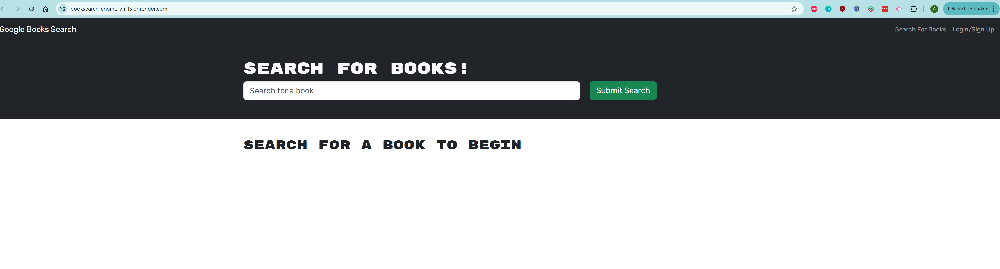
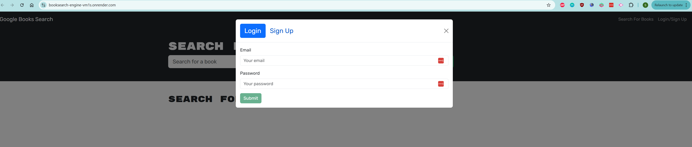
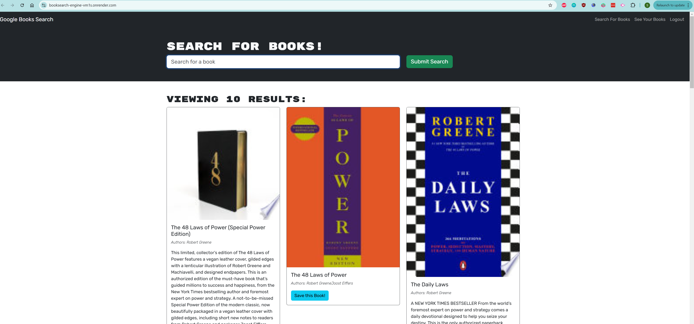

# book-search-engine

  

  Licence URL: [License](https://opensource.org/licenses/AGPL)

  ## Render Deployment
  https://booksearch-engine-vm1s.onrender.com

  ## Description
  This project showcases my different skills working with different frontend and backend techologies together with a github URL to each project source code

  ## Table of Contents
  - [Installation](#installation) 
  - [Usage](#usage) 
  - [Contribution](#contribution)
  - [Tests](#tests) 
  - [username](#username)  
  - [profile](#github-profile) 

  ## Installation
  run `npm install`
  then run `npm run start:dev` to run the deployment locally.

  ## Screenshots
  

  

  
  

  ## Contribution
  To contribute to this project, please create a pull request

  ## Tests
  None

  ## GitHub Profile
  https://github.com/stanmoriasi
